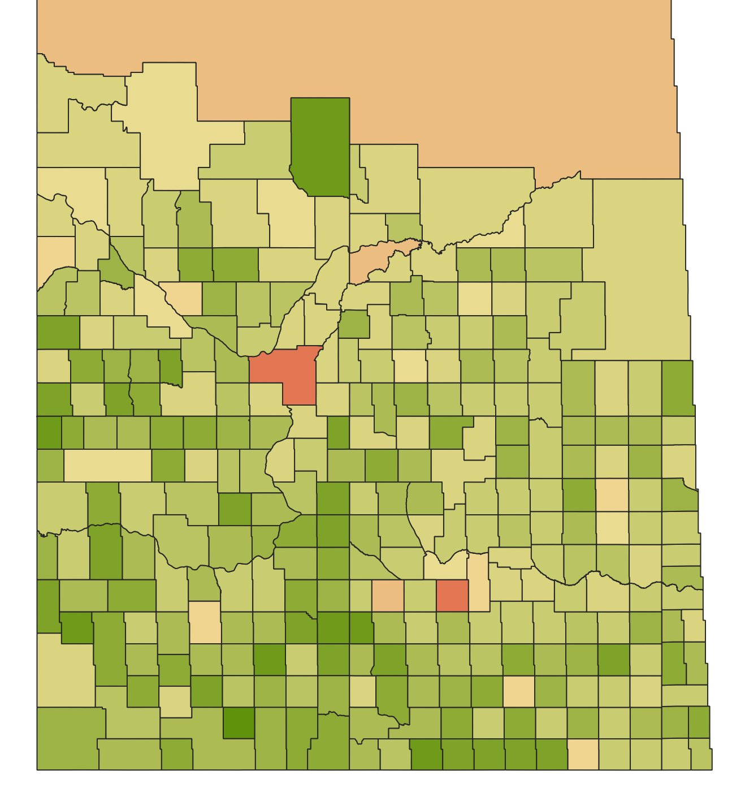
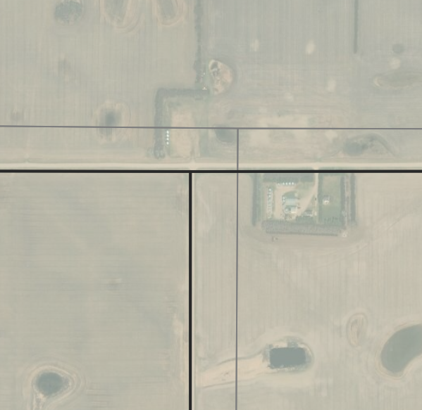
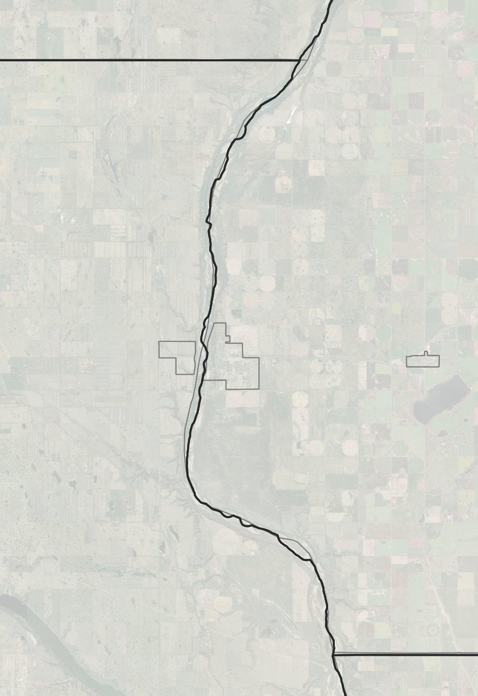

# Saskatchewan-Rural-Municipality-Map

A community generated map of rural municipalities in Saskatchewan, Canada. This repository includes two universal file formats of the same mapping layer for use in any GIS software (eg. QGIS) or data science focused programming language (eg. Python, R, etc.).

- data/Saskatchewan RMs.gpkg
- data/Saskatchewan-RMs.geojson




## Why this map exists:

### Statistics Canada CSD data quality

Stats Canada CSD files are OK, but they follow roads, instead of the actual Dominion Land Survey grid. The centre lines can cut corners and be a bit off in places. The image below shows a typical mis-representation of the CSD where the official version boundaries are in grey and this version is highlighted in black.



The same is also true for water features. The image below highlights the Outlook, SK Census Subdivision boundary along a waterway. Again, the official version is shown in grey and this version is in black.



## Sources

The map was created and updated based on the following sources:

- [Elections Saskatchewan polling places (2012)](https://www.elections.sk.ca/candidates-political-parties/maps/)
- [Township grid](https://hub.arcgis.com/datasets/e7e309c9bae94618807e7733133053d5_8)
- National Topographic Series CanVec water features (50K resolution)

These data sources were combined in QGIS, referencing the Sask government's read-only web layer, as well as CSDs from Statistics Canada and some historic maps (in order to figure out the "imaginary" boundaries that pass through reserves and towns).

## Using the data

### Python

```{python}
import geopandas as gpd

sask_rms = gpd.read_file('./data/Saskatchewan-RMs.geojson')

sask_rms.info()
sask_rms.head()
```

### R

```{r}
library(sf)

sask_rms <- sf::st_read('./data/Saskatchewan-RMs.geojson')

str(sask_rms)
head(sask_rms)
```

### QGIS

See [QGIS documentation](https://docs.qgis.org/2.6/pt_PT/docs/training_manual/introduction/preparation.html)

## Credits

Alex McPhee - [Web](https://t.co/LYlRw2Kudr?amp=1) / [Twitter](https://twitter.com/ksituan)
