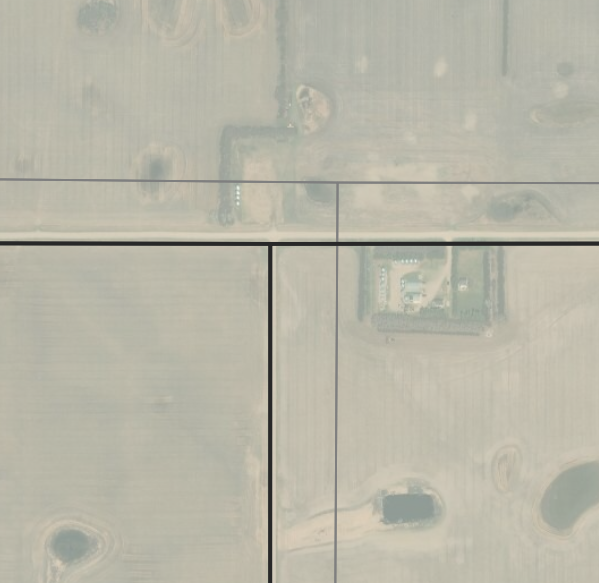
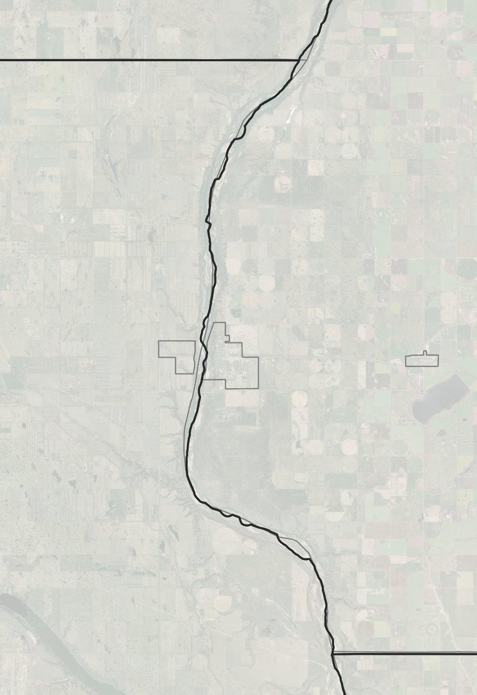

# Saskatchewan-Rural-Municipality-Map

## Why this map exists:

### Statistics Canada CSD data quality

Stats Canada CSD files are OK, but they follow roads, instead of the actual Dominion Land Survey grid. The centre lines can cut corners and be a bit off in places. 

The same is also true for water features.

